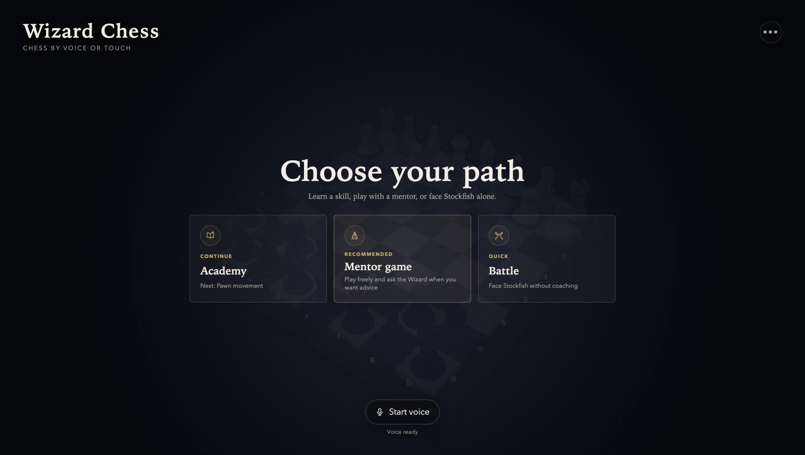
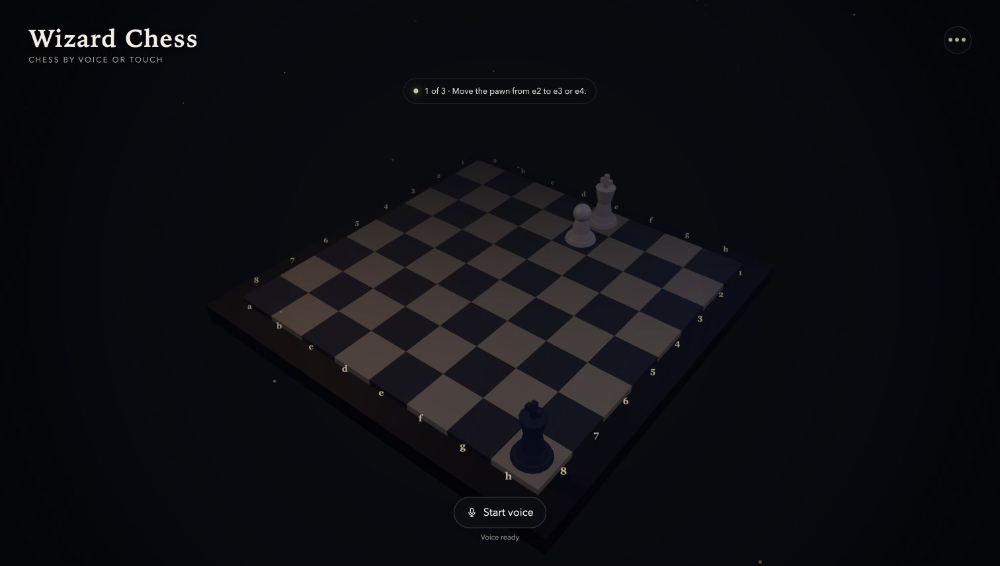
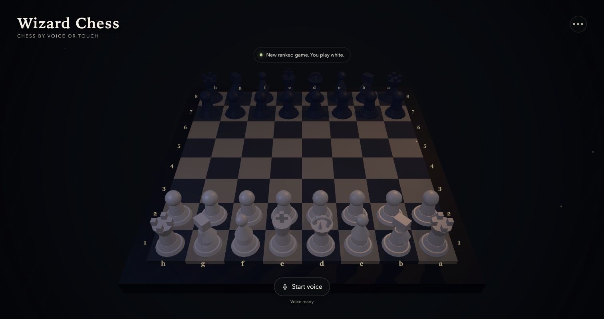

# Wizard Chess

A voice-first 3D chess game where a person and an AI agent share the same board.

Learn the rules in Academy, play with a live mentor, or face Stockfish in Battle. Every meaningful action is exposed through WebMCP, so an agent can read the exact position, explain it, and act without guessing where to click.

Built for the [OpenAI WebMCP Challenge](https://openai.com/webmcp-challenge/) on [Devpost](https://webmcp.devpost.com/).



## Why WebMCP fits chess

A chessboard is visual, but its state is structured. A screen-only agent has to infer 64 squares, identify 32 similar pieces, and translate a move into pointer coordinates. Wizard Chess gives the agent direct access to the same legal game state used by the player.

The agent can inspect the position with `get_game_state`, make a legal move with `make_move`, start a lesson, change the opponent, offer guidance, save a game, or replay one. The board updates immediately because the visible interface, built-in voice controller, and browser agent all call the same tool handlers.

This makes the agent part of the game loop. The player can ask what to do, choose whether to follow the advice, and continue entirely by voice.

## Three ways to play

- **Academy** contains six guided lessons across three levels. Each lesson teaches one idea with a focused position and validates the player's move before advancing.
- **Mentor game** is a complete match with optional, position-aware guidance. The mentor uses Stockfish analysis and the current board state when answering questions.
- **Battle** is a direct match against Stockfish. The player can choose either color and one of three strength settings: Apprentice at 1320, Duelist at 1750, or Master at 2400.





## How it works

```text
ChatGPT browser ── WebMCP ────────────┐
Built-in voice ── Gemini + Kokoro ────┼── game tools ── chess.js / Stockfish ── 3D board
Mouse or touch ────────────────────────┘
```

There are three ways into one game state:

1. **A browser agent** discovers 29 tools registered with `document.modelContext.registerTool()`.
2. **Built-in voice** records a request, sends it to the local `/api/voice` endpoint, and lets Gemini choose from the same tool definitions. The selected handler runs locally, then Kokoro speaks the response.
3. **Mouse or touch** calls those same game actions from the visible interface.

`chess.js` owns legal move validation. Stockfish 18 Lite runs in a Web Worker for opponent moves and analysis. Three.js renders the board, procedural pieces, spell trails, capture sparks, and camera movement.

The built-in voice loop uses:

- `google/gemini-3.1-flash-lite` through OpenRouter for audio understanding, tool selection, and concise answers
- `hexgrad/kokoro-82m` through OpenRouter for spoken responses

After the player grants microphone access and starts voice once, the game listens again after each spoken reply. Commands can cover the full flow, including onboarding, lessons, matches, moves, guidance, game controls, camera views, saves, history, and replay.

## Features

- Legal chess with castling, promotion, en passant, check, checkmate, stalemate, repetition, and draw detection
- A 3D board with sculpted pieces, square coordinates, orbit controls, spell trails, capture effects, and generated sound effects
- Six guided Academy lessons with saved progress
- Stockfish opponents at three UCI Elo settings
- A local player rating that starts at 1200 and updates after completed Battle games
- Stockfish-grounded move grading and on-demand mentor guidance
- Voice control for the whole game through the same actions exposed to WebMCP
- One-time narrated onboarding for Academy, Mentor game, and Battle
- Saved games, custom FEN positions, completed-game history, trophies, and move-by-move replay
- Browser-local settings and progress with no account required

## Install locally

You need [Node.js](https://nodejs.org/) 20.19 or newer and npm.

```bash
git clone https://github.com/borjasolerme/wizard-chess.git
cd wizard-chess
npm install
npm run dev
```

Open the URL printed by Vite, usually `http://localhost:5173`.

The board, lessons, Stockfish opponent, local progress, and WebMCP tools work without an API key. An OpenRouter key is only required for the built-in voice controller.

## Configure voice

The simplest setup is to open **Settings** inside the game and save an OpenRouter API key. The key stays in that browser and can be removed from the same screen.

For local development, you can instead create `.env.local`:

```bash
cp .env.example .env.local
```

Then replace the example value:

```dotenv
OPENROUTER_API_KEY=sk-or-v1-your-key-here
```

Restart the development server after changing the environment file. When voice is used, the app sends the recording and key to its same-origin `/api/voice` endpoint, which calls OpenRouter. It does not send the key during ordinary board play.

## Test WebMCP

### ChatGPT in-app browser

Deploy the app to a public URL and open it in ChatGPT's in-app browser. The tools register automatically when WebMCP is available.

Try prompts such as:

- “Start the pawn lesson.”
- “Move the pawn from e2 to e4.”
- “What should I play next?”
- “Set the opponent to Master and start a game as Black.”
- “Show my progress and replay my latest game.”

### Chrome

1. Open `chrome://flags/#enable-webmcp-testing`.
2. Enable WebMCP testing.
3. Restart Chrome and open the app.

If WebMCP is unavailable, the visual game remains playable through mouse, touch, and the built-in voice controller.

## WebMCP tool surface

All 29 tools have JSON input schemas, focused descriptions, and read-only hints where appropriate. They call the same actions as the visible interface.

<details>
<summary>View all 29 tools</summary>

### Onboarding and lessons

- `advance_onboarding`
- `get_onboarding_guidance`
- `list_lessons`
- `start_lesson`

### Play and game control

- `make_move`
- `start_ranked_game`
- `set_difficulty`
- `set_game_paused`
- `undo_last_turn`
- `resign_game`
- `offer_draw`
- `load_custom_position`

### Position and coaching

- `get_game_state`
- `explain_last_move`
- `get_mentor_guidance`
- `set_mentor_enabled`
- `get_post_game_review`
- `start_recommended_lesson`

### Progress and history

- `get_progress`
- `get_leaderboard`
- `list_history`
- `start_replay`
- `step_replay`
- `exit_replay`

### Saves and camera

- `save_game`
- `list_saved_games`
- `load_saved_game`
- `delete_saved_game`
- `set_camera_view`

</details>

## Verify the project

Run the automated tests and TypeScript check:

```bash
npm test
npx tsc --noEmit
```

Create and preview a production build:

```bash
npm run build
npm run preview
```

## Deployment

The repository is ready for Vercel. The frontend builds as a Vite SPA, while [`api/voice.mjs`](api/voice.mjs) provides the production voice endpoint.

1. Import the GitHub repository into Vercel.
2. Keep the detected Vite build settings.
3. Optionally add `OPENROUTER_API_KEY` as a server environment variable for a shared voice fallback.
4. Deploy and test the public URL in a WebMCP-enabled browser.

The core game can run on any static host. Built-in voice also needs a compatible serverless or server endpoint at `/api/voice`.

## Project map

| Path | Purpose |
| --- | --- |
| `src/main.ts` | Game state, Three.js scene, interface, and WebMCP registration |
| `src/lesson.ts` | Academy lesson definitions and validation |
| `src/stockfish.ts` | Local Stockfish worker and analysis |
| `src/mentor.ts` | Move grading and coaching context |
| `src/voice.ts` | Microphone, tool selection, execution, and spoken reply loop |
| `server/openrouter.mjs` | OpenRouter audio understanding and speech generation |
| `src/progress.ts` | Local lessons, trophies, history, and replay data |
| `src/rating.ts` | Local Elo calculation and opponent settings |
| `api/voice.mjs` | Vercel serverless voice route |

## Scope

This version uses original procedural chess pieces so it stays fast, deployable, and legally clear. Film-accurate character models and generated cinematic capture clips are ideas for a later version.

## License

[MIT](LICENSE)

The bundled Stockfish.js engine is GPLv3. Its license is copied beside the generated engine assets during installation and production builds.
