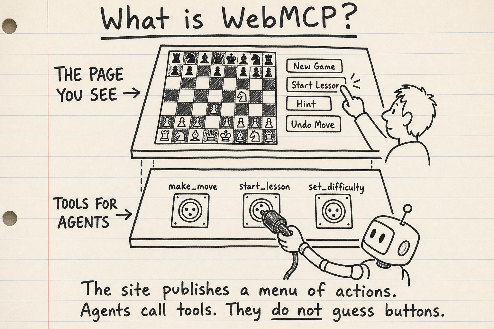
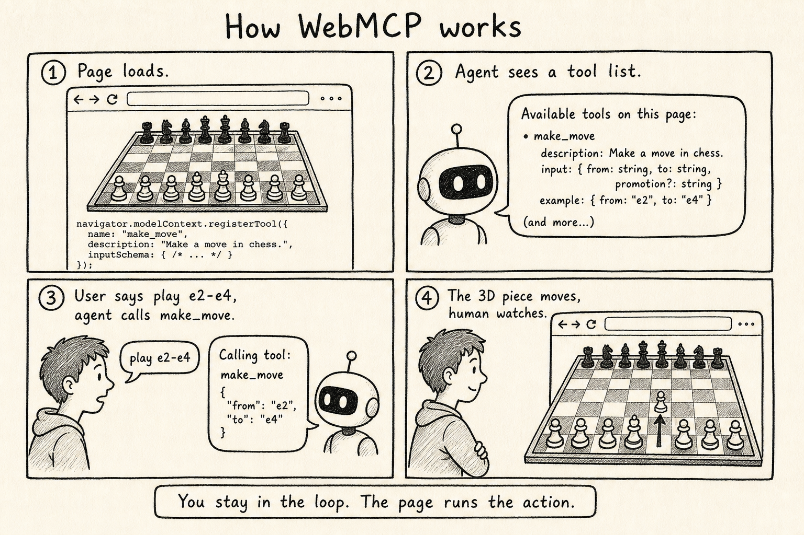
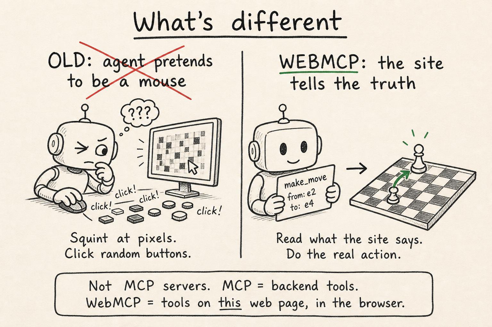
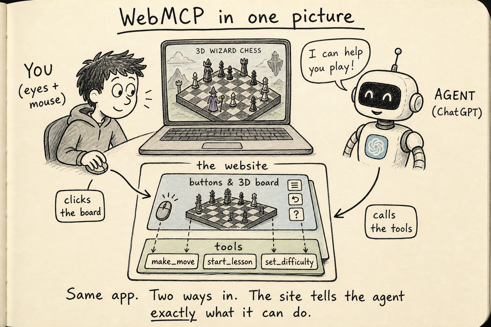
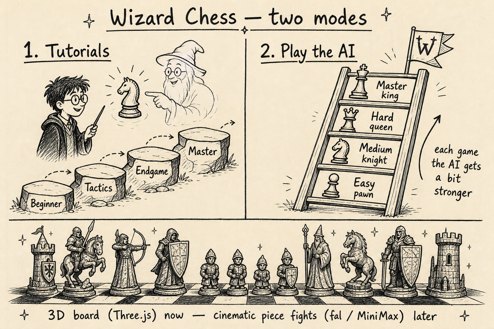

# What is WebMCP?

WebMCP lets a website offer **named actions** to an AI agent. You still use the mouse. The agent does not guess buttons. It calls tools the page published.

The site publishes a menu of actions. Agents call tools. They do not guess buttons.

## How it works

1. The page loads and registers tools with `document.modelContext.registerTool`.
2. ChatGPT (in-app browser) sees that tool list.
3. You say something like “play e2 to e4”. The agent calls `make_move`.
4. The 3D piece actually moves. You watch.

You stay in the loop. The page runs the action.

## What is different

**Old:** the agent pretends to be a mouse. It squints at pixels and clicks. Easy to miss the square.

**WebMCP:** the site tells the truth. `make_move` from e2 to e4. The piece moves.

This is **not** an MCP server. MCP = tools on a backend. WebMCP = tools on **this web page**, in the browser, with you watching.

## Same idea, chess-shaped

A person clicks the board. An agent calls `make_move`, `start_lesson`, `set_difficulty`. Same game.

## Two modes we are building

1. Tutorials, beginner to master
2. Play the AI; each game it gets a bit stronger

Cinematic piece fights (fal / MiniMax) come later. Three.js board first.

## How to test

- ChatGPT in-app browser: WebMCP works there
- Chrome: `chrome://flags/#enable-webmcp-testing`, enable, restart
